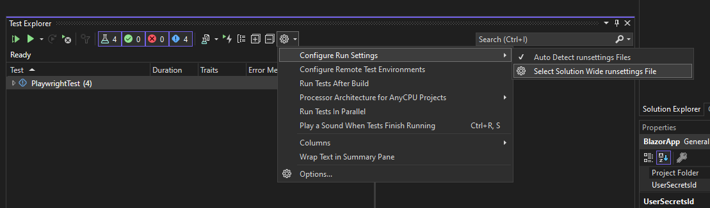

# Blazor Playwright

This is a sample application to demonstrate how to use Playwright with Blazor
Webassembly, both locally and with Github Actions. I didn't found something
similar when I needed it, so I decided to do this like a template for myself. It
took a lot of time to get all the details right.

Some features of this solution are:

* The are Playwright test both for desktop and mobile (only Chromium supports
  mobile testing).
* There are profiles created for Chromium, Firefox and Webkit.
* The Github Actions are executed on Ubuntu, Windows and MacOS and is testing
    with Chromium, Firefox and Webkit (Webkit is excluded on Window, because
    [Webassembly is not
    supported](https://github.com/microsoft/playwright/issues/2876)).
* The Github Actions runs all tests locally.
* If the Github Actions fails, the test results are uploaded as artifacts and
  can be analyzed at <https://trace.playwright.dev/>.

## Installing Playwright

To install Playwright, first build the test project:

    dotnet build ./PlaywrightTest/PlaywrightTest.csproj

And then run the following command:

    pwsh ./PlaywrightTest/bin/Debug/net8.0/playwright.ps1 install --with-deps  

## How to run the tests locally in Visual Studio

Before you starts the test, you first need to start the BlazorApp. Once this is
running, you can run the tests.

If you haven't selected a runsettings file, Chromium will be used in headless
mode (you will not see the browsers while the tests are running).

But if you want to see the browsers, you can select the runsettings for the
browser you want to use.

* chromium.runsettings
* firefox.runsettings
* webkit.runsettings

Remember that that Webkit doesn't support Webassembly on Windows.

## How to run the tests locally in the command line

You need the start the application before running any of the test.

### Start the application

In the `BlazorApp` directory:

    dotnet watch run

This works fine in Windows, but in Linux there might be issues loading the page.

Instead, publish the application:

    dotnet publish 

Then use dotnet-serve to host the application:

    dotnet tool install --global dotnet-serve
    dotnet serve --directory ./bin/Release/net8.0/publish/wwwroot --fallback-file index.html --port 5097

Then you can run the tests in the test directory, also with UI and Webkit.

### Run tests

In the `PlaywrightTest` directory run:

    dotnet test

To debug, set environment variable `env:PWDEBUG` to `1`:

    $env:PWDEBUG=1 (PowerShell)
    export PWDEBUG=1 (Bash)

To run or debug a single test:

    dotnet test --filter "Name~NavigateToCounterPage"

To test with different browser:

    dotnet test -- Playwright.BrowserName=firefox
    dotnet test -- Playwright.BrowserName=chromium
    dotnet test -- Playwright.BrowserName=webkit

You can also use the runsettings files:

    dotnet test --settings chromium.runsettings
    dotnet test --settings firefox.runsettings
    dotnet test --settings webkit.runsettings

In BlazorTest.cs, the default URL is defined. You can override this by setting
the environment variable `BASE_URL`:

    $env:BASE_URL="http://localhost:5000" (PowerShell)
    export BASE_URL="http://localhost:5000" (Bash)

## Analyzing a failed test

If a test fails, a trace file is created in the
`BlazorPlaywright/PlaywrightTest/bin/Debug/net8.0/` directory. You can upload
this file to <https://trace.playwright.dev> to analyze the test. Or you can
analyze it if from the command line:

    pwsh ./bin/Debug/net8.0/playwright.ps1 show-trace .\bin\Debug\net8.0\playwright-traces\the-test.zip

## Generate a test

To generate a test, run the following command:

    pwsh ./bin/Debug/net8.0/playwright.ps1 codegen

To generate for mobile, specify also a device:

    pwsh ./bin/Debug/net8.0/playwright.ps1 codegen --device="Pixel 7"
